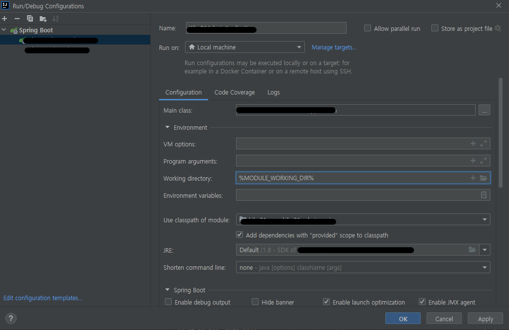

# 멀티 모듈 사용시 working directory 설정
* 인텔리제이 커뮤니티가 아닌 Ultimate를 쓰는 사람들은 Spring boot 이용시 스프링 프로필 설정을 쉽게 할 수 있다. `Run` 탭에서 `Edit Configurations` 를 누르면 스프링 프로필 설정을 할 수 있는데, 커뮤니티 버전에서는 지원하지 않는 부분이다.

* `Edit configurations`에 들어가면 `Working directory`설정 부분이 있는데 옆에 `+`부분을 누르면 `%MODULE_WORKING_DIR%`값 설정을 할 수가 있다. 이렇게 설정을 해두면 Run되는 모듈을 찾아서 디렉토리 설정을 해준다. 설정하지 않는다면 resource같은 path들이 모듈들의 윗단인 프로젝트 부분부터 경로를 잡기 때문에 꼭 해줘야 한다.
