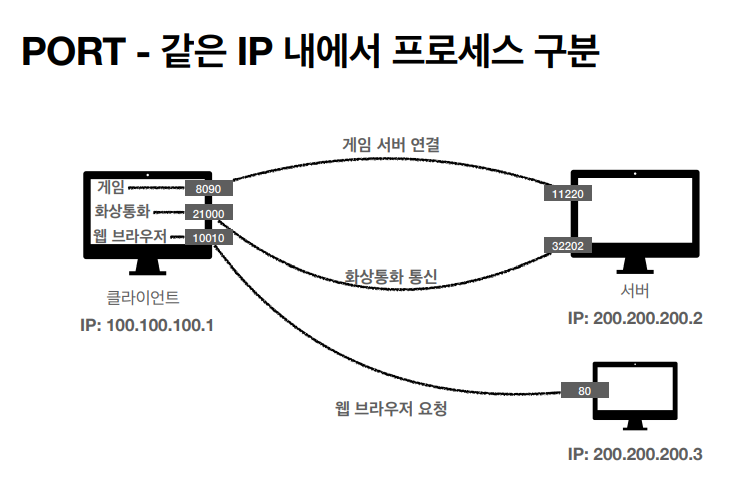

# PORT
* 한 IP에 둘 이상 연결해야 된다면?

* 화상 통화를 하면서 웹 브라우저로 웹 서핑을 한다면?

* 그럼 통화하는 서버에서 보내준 패킷과 웹 브라우저 서버에서 보내준 패킷이 온다. 그럼 이 패킷이 통화를 위한 패킷인지 브라우저를 위한 응답 패킷인지 구분을 해야하는 상황이 온다.

## 출발지PORT, 목적지 PORT
* TCP/IP 패킷 정보에는 여러가지가 담겨있는데, 그 중 출발지PORT, 목적지 PORT가 담겨있다. 
* IP는 목적지 서버를 찾는 것이다.
* 목적지 서버에서 돌아가는 애플리케이션들을 찾는 것이 PORT의 역할이다.

## 같은 IP 내에서 프로세스 구분

* 게임 서버 연결, 화상통화 통신, 브라우저 요청 같이 port를 통해서 구분해 패킷을 주고 받는다.
* IP가 아파트라면 PORT는 동 호수를 말한다.
* 0 ~ 65535 할당 가능하다.
* 0 ~ 1023 은 잘 알려진 포트라서 사용하지 않는 것이 좋다.
    * FTP - 20, 21
    * TELNET - 23
    * HTTP - 80
    * HTTPS - 443