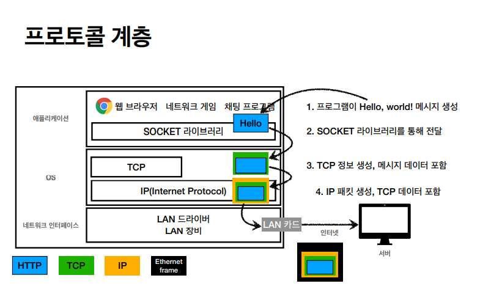
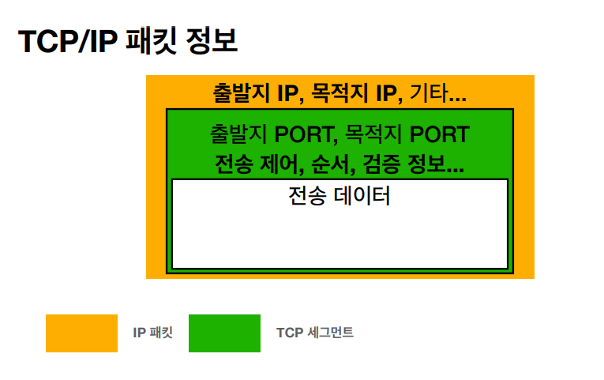
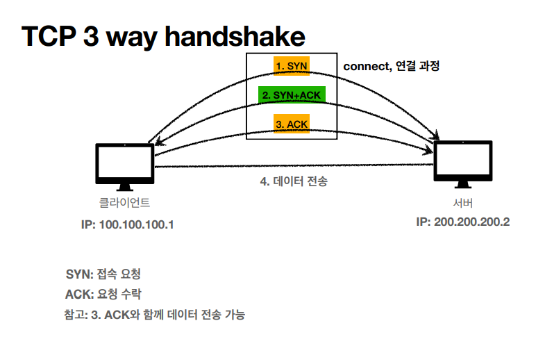

# TCP - 전송제어 프로토콜(Transmission Control Protocol)

## 인터넷 프로토콜 스택의 4계층
* 애플리케이션 계층 - HTTP, FTP
* 전송 계층 - TCP, UDP
* 인터넷 계층 - IP
* 네트워크 인터페이스 계층

## 프로토콜 계층

* 생성된 메세지를 소켓 라이브러리를 통해 전달 되고, TCP로 감싼 다음에 IP패킷에 담아서 보내진다.
## TCP/IP 패킷 정보

* 출발지port,목적지port, 전송제어, 순서, 검증 정보 등이 같이 담겨서 IP만으로 할 수 없었던 문제들이 해결된다.

* 연결지향적이다. 연결이 되었나 확인 한 후에 메세지를 보낸다. TCP 3 way handshake
* 이 때문에 메세지가 잘 갔나 안갔나 확인이 되어서 데이터 전달 보증을 해준다.
* 순서에 관한 것도 TCP에 담겨서 순서도 보장해준다.
* IP 주소 하나만 있을 때 생긴 문제들을 해결해줘서 신뢰할 수 있는 프로토콜이다.
* 이 떄문에 현재 대부분 TCP를 사용한다.

## TCP 3 way handshake

* 클라이언트에서 서버로 SYN(접속요청)을 보내고 서버 또한 요청을 받고 다시 SYN을 보내면서 ACK(요청수락)을 함께 보낸다. 받은 클라이언트는 주고 받은 SYN과 ACK를 받고서 ACK를 보내는데, 이 3번의 과정이 끝나고 나면 데이터를 전송한다.
* 클라이언트에서 SYN을 날렸는데 응답이 없으면 애초에 메세지를 보내지 않는다. 
* 요즘은 클라이언트에서 마지막 ACK을 보낼때 데이터를 함께 보낸다.
* 실제로 물리적으로 포트끼리 연결 되었다는 개념이 아니다. 실제론 클라이언트와 서버 사이에 수 많은 노드들이 존재하고 노드들이 직접적으로 연결되어있지 않지만, 요청과 수락의 단계를 거치면서 전송 가능한 상태를 확인 했기 떄문에 연결되었다고 개념적으로 정의 하는 것이다.
* 데이터 전달 보증
    * 위 단계들을 거치고 마지막에 데이터를 전송 하면 서버에서 데이터를 잘 받았다고 보내준다.
* 순서 보장
    * 패킷1,2,3을 순서로 보냈는데 서버에서 순서가 다르게 1,3,2 로 받았다면 기존에 받은 패킷을 버리고 패킷2부터 다시 보내라고 응답 해준다. 이 부분은 받는 서버에서 최적화를 통해 해결할 수 있는 부분이지만, 기본적인 설정은 이렇다.

# UDP - 사용자 데이터그램 프로토콜(User Datagram Protocol)
* 하얀 도화지(말 그대로 기능이 거의 없다)
* TCP 처럼 연결지향, 데이터보증, 순서보장 같은 기능들이 없다.
* 단순하고 빠르다.
* IP와 거의 같다. 단, PORT와 체크섬 정도만 추가.
    * PORT -  내 IP는 하나인데 여러 애플리케이션을 쓴다. 이 경우 여러 데이터 패킷을 받아서 어디다 보낼지 구분하기 위해 생긴 것이다.
    * 체크섬 - 메세지에 대해서 제대로 맞는 검증해 주는 데이터.
* TCP는 이미 인터넷 기반에 여기저기 존재하기 때문에 손을 대기 힘들다. 3way handshake 때문에 빠른 속도를 기대하기 힘들다. 그래서 UDP를 쓰면서 애플리케이션 레벨에서 원하는 기능을 추가해서 쓰는 곳이 늘어나고 있다. 
* 최근 http3 스팩이 나왔는데, TCP의 SYN, ACK의 단계를 줄여보자해서 최적화를 하며 UDP프로토콜을 사용하고 있다. 