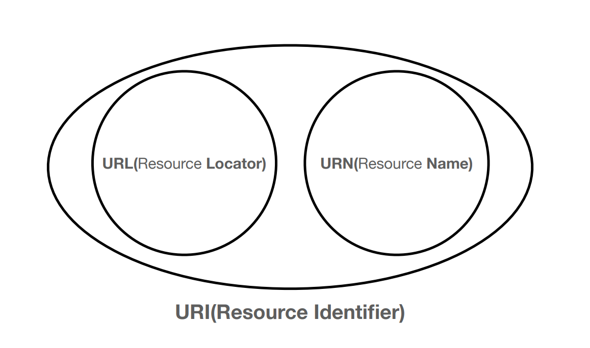
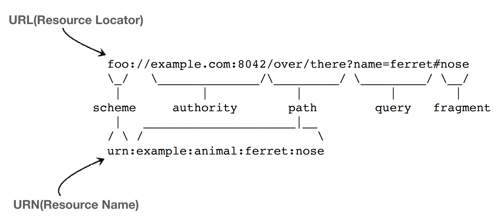

# URI

* URI - Uniform Resource Identifier - 리소스를 식별하는 통합된 방법
* URI는 로케이터(locater), 이름(name), 또는 둘 다로 분류 될 수 있다.
* URL은 Resource의 위치, URN은 Resource의 이름이다.

* 우리가 흔히 쓰는 것은 URL이다. URN처럼 그냥 이름을 부여 하면 찾기가 힘들다.

## URI 의 뜻
* Uniform : 리소스 식별하는 통합된 방식
* Resource : 자원, URI로 식별할 수 있는 모든 것(제한 없음)
* Identifier : 다른 항목과 구분하는데 필요한 정보
* URN : Uniform Resource Name - 리소스에 이름을 부여
* URL : Uniform Resource Locater - 리소스의 위치를 지정
* 위치는 변경 될 수 있지만, 이름은 변경되지 않는다.
* URN 이름만으로 실제 리소스를 찾을 수 있는 방법은 보편화 되지 않음.
* URI와 URL와 같은 의미로 봐도 무방하다.

## URL 전체 문법
* scheme://[userinfo@]host[:port][/path][?query][#fragment]
* https://www.google.com:443/search?q=hello&hl=ko

### scheme
* 주로 프로토콜을 사용
* 프로토콜 : 어떤 방식으로 자원에 접근할 것인가 하는 약속, 규칙
    * 예) http, https, ftp 등
* http는 보통 80포트 https는 443포트를 쓴다. 포트는 생략 가능하다.
* https는 http에 보안을 추가한 것이다. (HTTP Secure)

### userinfo
* URL에 사용자정보를 포함해서 인증
* 거의 사용하지 않음

### host
* 호스트명(www.google.com)
* 도메인명 또는 IP주소를 직접 사용가능

### port
* 포트(PORT)
* 접속 포트
* 일반적으로 생략, 생략이 http는 80, https는 443

### path
* 리소스 경로(path), 계층적 구조
    * 예) /home/file.jpg
    * 예) /members/100, /items/iphone12

### query
* key=value의 형태
* ?로 시작, &으로 추가 가능
    * ?keyA=valueA&keyB=valueB
* query parameter, query string으로 불린다. 웹서버에 제공하는 파타미터
* 숫자를 적어도 문자 형태로 넘어가기 때문에 query string이라고 한다.

### fragment
* html 내부 북마크 등에 사용.
* html 내부에서 갑자기 중간에 이동하고 싶을 때 사용한다.
* 서버에 전송되는 정보는 아니다.
