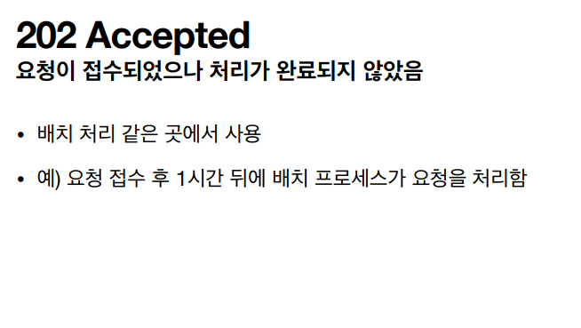
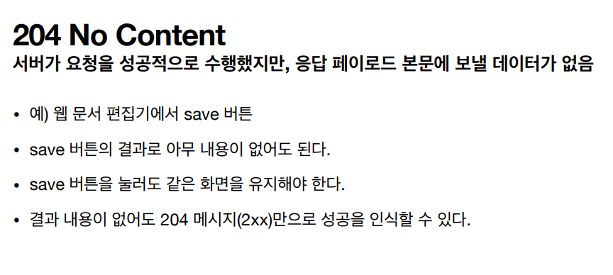

# HTTP 상태코드

## 클라이언트가 보낸 요청의 처리 상태를 응답에서 알려주는 기능

* 1xx (Informational): 요청이 수신되어 처리중
* 2xx (Successful): 요청 정상 처리
* 3xx (Redirection): 요청을 완료하려면 추가 행동이 필요
* 4xx (Client Error): 클라이언트 오류, 잘못된 문법등으로 서버가 요청을 수행할 수 없음
* 5xx (Server Error): 서버 오류, 서버가 정상 요청을 처리하지 못함

## 만약 모르는 상태 코드가 나온다면?
* 클라이언트가 인식할 수 없는 상태코드를 서버가 반환한다면?
* 클라이언트는 상위 상태코드로 해석해서 처리
* 미래에 새로운 상태코드가 추가되어도 클아이언트를 변경하지 않아도 된다.
* 예)
    * 299 ??? - 2xx(Successful)
    * 451 ??? - 4xx(Client Error)
    * 599 ??? - 5xx(Server Error)

# 1xx(Information)
### 요청이 수신되어 처리중
* 거의 사용하지 않아 생략

# 2xx(Successful)
* 클라이언트의 요청을 성공적으로 처리

## 200 OK

* 요청 성공

## 201 Creat

* 클라이언트의 요청으로 서버쪽에서 어떤 리소스를 생성한 것 - 주로 Post로 뭔가 등록을 했을 때 나옴
* Header 부분에 Location을 넣어줘서 새로 생성된 리소스의 URI를 넣어준다.

## 202 Accepted

* 요청이 접수되었으나 처리가 완료되지 않음
* 배치 처리 같은 곳에서 사용한다
* 예) 요청 접수 후 1시간 뒤에 배치 프로세스가 요청을 처리한다

## 204 No Content

* 서버가 요청을 성공적으로 수행했지만, 응답 페이로드 본문에 보낼 데이터가 없음
* 예) 웹 문서 편집기에서 save 버튼
* save 버튼의 결과로 아무 내용이 없어도 된다.
* save 버튼을 눌러도 같은 화면을 유지해야 한다.
* 결과 내용이 없어도 204 메세지(2xx)만으로 성공을 인식할 수 있다.

## 그럼 2xx 상태코드를 다 사용하는 것이 좋은가?
* 그렇지는 않다. 200 ok만 사용하는 곳도 있고, 201R까지만 사용하자고 각 팀들이 내부적으로 정해서 쓰자고 범위를 잡고 사용하는 경우가 많다.
* 일일히 적용해서 쓰기가 쉽지 않다.

# 3xx - 