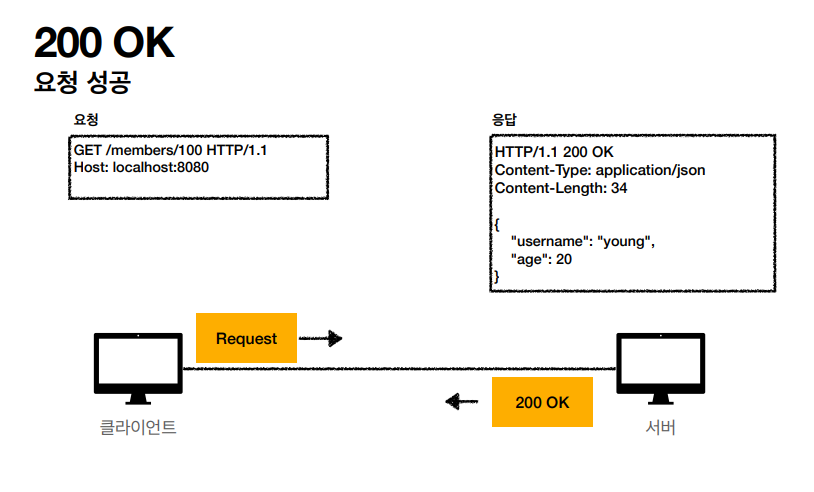
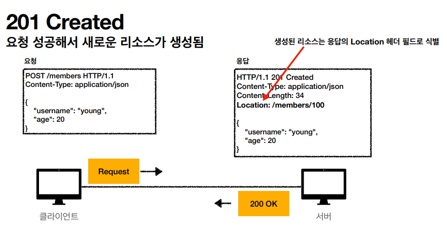
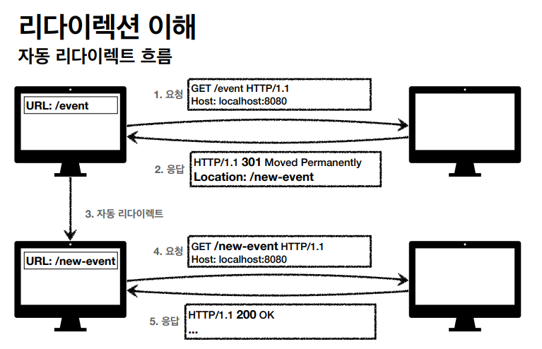
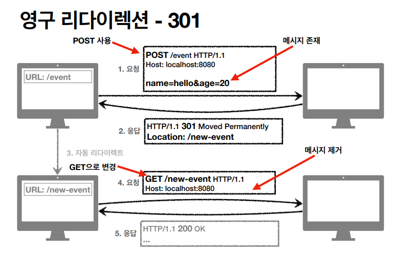
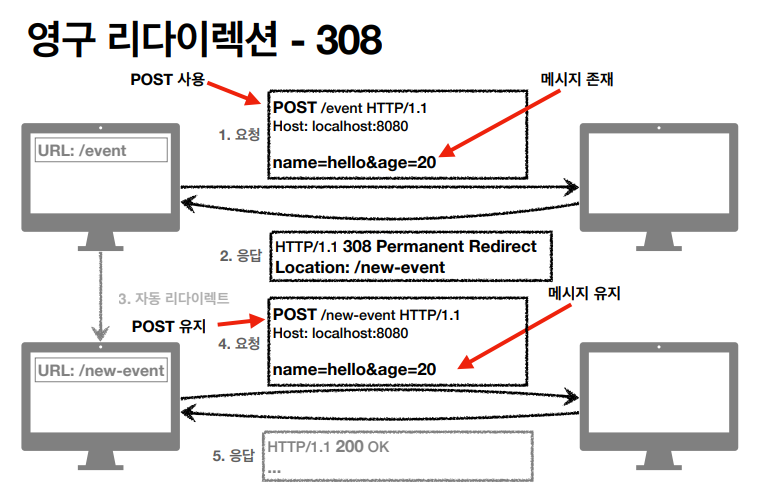
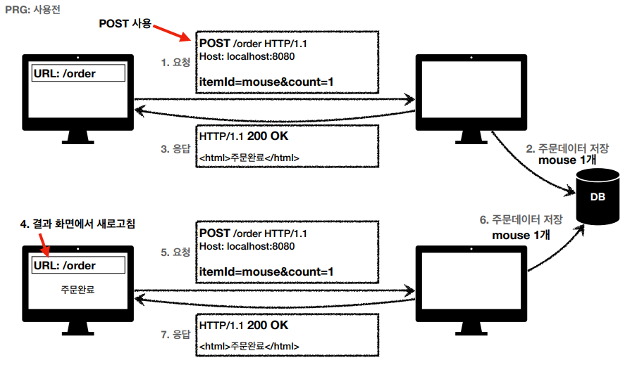
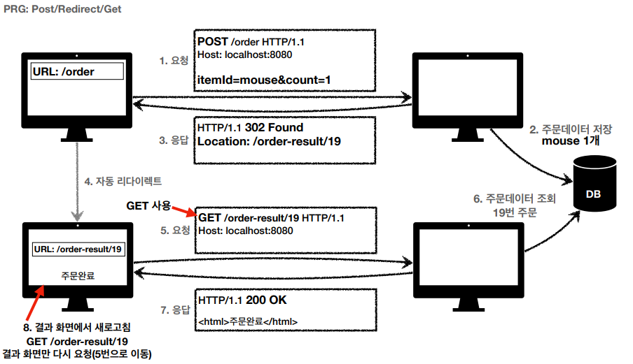

# HTTP 상태코드

## 클라이언트가 보낸 요청의 처리 상태를 응답에서 알려주는 기능

* 1xx (Informational): 요청이 수신되어 처리중
* 2xx (Successful): 요청 정상 처리
* 3xx (Redirection): 요청을 완료하려면 추가 행동이 필요
* 4xx (Client Error): 클라이언트 오류, 잘못된 문법등으로 서버가 요청을 수행할 수 없음
* 5xx (Server Error): 서버 오류, 서버가 정상 요청을 처리하지 못함

## 만약 모르는 상태 코드가 나온다면?
* 클라이언트가 인식할 수 없는 상태코드를 서버가 반환한다면?
* 클라이언트는 상위 상태코드로 해석해서 처리
* 미래에 새로운 상태코드가 추가되어도 클아이언트를 변경하지 않아도 된다.
* 예)
    * 299 ??? - 2xx(Successful)
    * 451 ??? - 4xx(Client Error)
    * 599 ??? - 5xx(Server Error)

# 1xx(Information)
### 요청이 수신되어 처리중
* 거의 사용하지 않아 생략

# 2xx(Successful)
* 클라이언트의 요청을 성공적으로 처리

## 200 OK

* 요청 성공

## 201 Creat

* 클라이언트의 요청으로 서버쪽에서 어떤 리소스를 생성한 것 - 주로 Post로 뭔가 등록을 했을 때 나옴
* Header 부분에 Location을 넣어줘서 새로 생성된 리소스의 URI를 넣어준다.

## 202 Accepted
* 요청이 접수되었으나 처리가 완료되지 않음
* 배치 처리 같은 곳에서 사용한다
* 예) 요청 접수 후 1시간 뒤에 배치 프로세스가 요청을 처리한다

## 204 No Content
* 서버가 요청을 성공적으로 수행했지만, 응답 페이로드 본문에 보낼 데이터가 없음
* 예) 웹 문서 편집기에서 save 버튼
* save 버튼의 결과로 아무 내용이 없어도 된다.
* save 버튼을 눌러도 같은 화면을 유지해야 한다.
* 결과 내용이 없어도 204 메세지(2xx)만으로 성공을 인식할 수 있다.

## 그럼 2xx 상태코드를 다 사용하는 것이 좋은가?
* 그렇지는 않다. 200 ok만 사용하는 곳도 있고, 201까지만 내부적으로 정해서 범위를 잡고 사용하는 경우가 많다.
* 일일히 적용해서 쓰기가 쉽지 않다.

# 3xx - 리다이렉션
* 요청을 완료하기 위해 클라이언트의 추가 조치가 필요한 것을 알려주는 것
* 웹 브라우저는 3xx 응답 결과에 Location Header가 있으면 Location 위치로 자동이동(리다이렉트)한다.

## 리다이렉션의 이해

* /event로 요청한 uri가 이제 더이상 쓰이지 않고 /new-event로 대체되었으면 301 Moved Permanently(영원히 바뀜)처리가 되어 Location에 바뀐 URI를 응답해주는데 이걸 자동으로 리다이렉트처리를 해준다. 그럼 바뀐 URI를 유저입장에서 다시 요청하게 되고 응답에선 현재 사용하고 있는 URI이기 때문에 200 ok 응답이 오게된다.

## 리다이렉션의 종류
* 영구 리다이렉션 - 특정 리소스의 URI가 영구적으로 이동
    * /members - /users
    * /event - /new-event
* 일시 리다이렉션 - 일시적인 변경
    * 주문 완료 후 주문 내역 화면으로 이동
    * PRG: Post/Redirect/Get - 자주 쓰는 특수 패턴
* 특수 리다이렉션
    * 결과 대신 캐시를 사용

## 영구 리다이렉션 - 301, 308
* 리소스의 URI가 영구적으로 이동
* 원래의 URL을 사용X, 검색 엔진 등에서도 변경 인지
* 301 Moved Permanently
    * 리다이렉트시 요청 메서드가 **GET**으로 변하고 본문이 제거될 수 있음(무조건 바뀌는 것이 아님)
* 308 Permanent Redirect
    * 301과 기능은 같다.
    * 리다이렉트시 요청 메서드와 본문 유지(**처음 POST를 보내면 리다이렉트도 POST 유지**)

## 301

* 클라이언트가 Post로 요청(메세지가 존재)한다.
* 더이상 쓰지 않는 URI라서 301로 응답코드를 보낸다.
* 그걸 받은 클라이언트는 URL의 경로를 바꾼다. 이때 **GET**으로 변경되고 메세지(본문이)가 사라진다. 하디만 무조건 그런 것은 아니다.
* 서버 입장에서는 새로운 요청이기 때문에 /new-event 페이지를 보여준다.

## 308

* 처음 클라이언트가 Post로 요청을 한다.
* 서버에선 308로 응답을 해준다.
* 받은 클라이언트는 처음 요청한 **POST**를 유지한 상태에서 다시 서버에 요청을 한다.
* 사실 실무에서는 거의 사용하지 않는다. 사실상 /event에서 /new-event로 바뀐다면 업무적으로 전달해야되는 데이터 자체가 다 바뀌기 때문에 POST로 와도 GET으로 다시 돌리는 경우가 많다.

## 일시적인 리다이렉션 - 302, 307, 303
* 리소스의 URI가 일시적으로 변경
* 따라서 검색 엔진 등에서 URL을 변경하면 안됨
* 302 Found
    * 리다이렉트 요청 메서드가 GET으로 변하고, 본문이 제거될 수 있음
* 307 Temporary REdirect
    * 302와 기능은 같음
    * 리다이렉트시 요청 메서드와 본문 유지(요청 메서드를 변경하면 안된다. Must Not)
* 303 See Other
    * 302와 기능은 같음
    * 리다이렉트 요청 메서드가 GET으로 변경

## PRG: Post/Redirect/Get - 일시적인 리다이렉션 - 예시
* Post로 주문 후에 웹 브라우저를 새로고침하면?
* 새로고침은 마지막에 요청을 다시 요청한다.
* 중복 주문이 될 수 있다.

* 실무에선 서버에서 막아야 된다. 주문코드를 받아서 중복으로 들어오면 잘못된 코드라는 식으로 처리한다.
* 이것을 막기 위해 PRG를 사용한다.
* POST로 주문 후에 새로고침으로 인한 중복 주문 방지
* POST로 주문 후에 주문 결과 화면을 GET메서드로 리다이렉트
* 새로고침 해도 결과 화면을 GET으로 조회
* 중복 주문 대신에 결과 화면만 GET으로 다시 요청.

* 처음 POST로 요청을 하고나서 서버에서 주는 응답을 302 Found로 준다. 여기에는 Location이 담겨있다.
* 응답을 받은 클라이언트는 302를 받았기 때문에 받은 Location으로 리다이렉트를 한다.
* 리다이렉트를 하면서 GET으로 요청하기 때문에 요청을 받은 서버는 GET으로 주문데이터를 조회한다.
* 새로고침을 한다해도 마지막에 요청한 GET(주문데이터조회)를 반복하기 때문에 중복 주문을 막을 수 있다.
* 이렇게 하면 사용성(사용자 입장)이 좋아진다.
* 서버의 부하도 줄어든다.

## 그래서 뭘 써야 하는가?
* 302 Found - GET으로 변할 수 있음
* 307 Temporary Redirect - 메서드가 변하면 안됨
* 303 See Other - 메서드가 GET으로 변경
* 처음 302 스펙의 의도는 HTTP 메서드를 유지하는 것
* 하지만 웹 브라우저들이 대부분 GET으로 바꾸어버림
* 그래서 모호한 302를 대신하는 307, 303이 등장했다.(301의 대응으로 308도 등장)
* 그래서 307, 303을 권장하지만 현실적으로 이미 많은 애플리케이션 라이브러리들이 302를 기본값으로 사용하고 있다.
* 자동 리다이렉션시 GET으로 변해도 되면 그냥 302를 사용해도 문제 없다.

## 기타 리다이렉션 - 300, 304
* 300 Multiple Choices: 안쓴다.
* 304 Not Modified
    * 캐시를 목적으로 사용
    * 클라이언트에게 리소스가 수정되지 않았음을 알려준다. 따라서 클라이언트는 로컬 PC에 저장된 캐시를 재사용한다.(캐시로 리다이렉트 한다.)
    * 304 응답은 응답에 메시지 바디를 포함하면 안된다.(로컬 캐시를 사용해야 하므로)
    * 조건부 GET, HEAD 요청시 사용