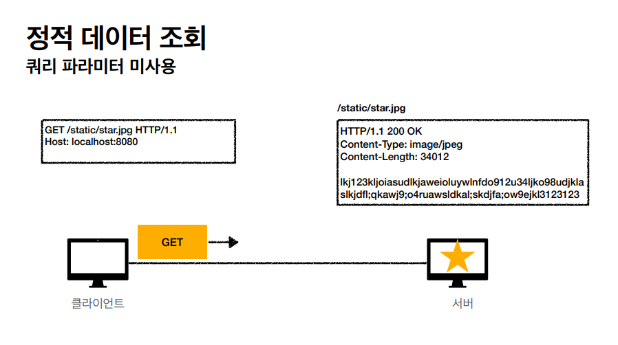
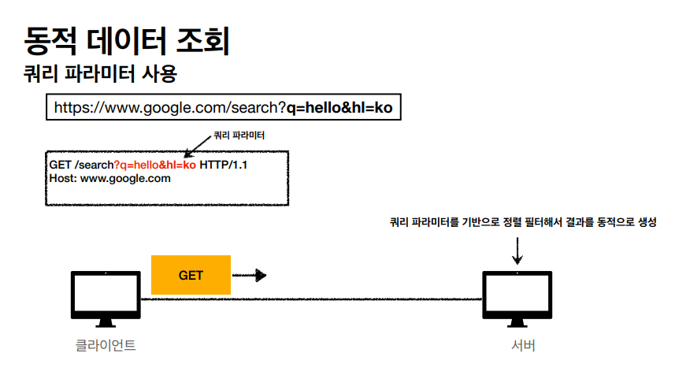
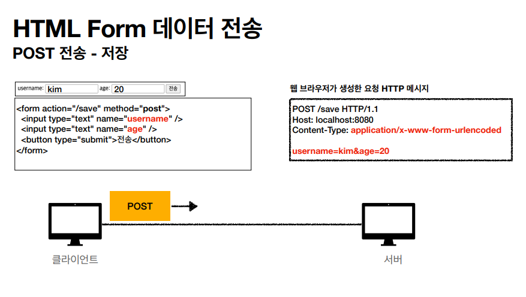
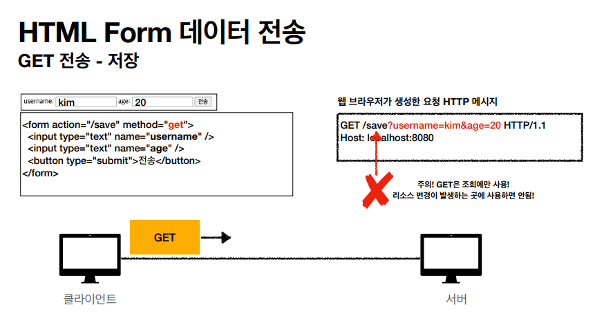
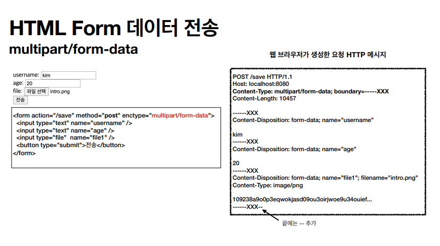
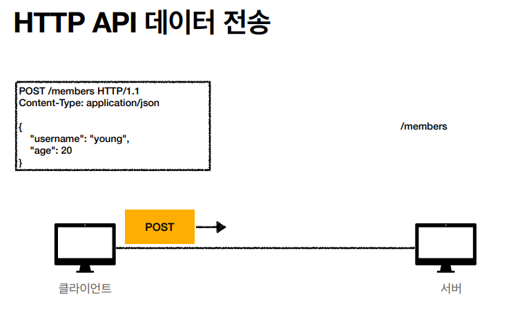

# 클라이언트에서 서버로 데이터 전송
* 쿼리 파라미터를 통한 데이터 전송
    * GET
    * 주로 정렬 필터(검색어)
* 메세지 바디를 통한 데이터 전송
    * POST, PUT, PATCH
    * 회원 가입, 상품 주문, 리소스 등록, 리소스 변경

## 4가지 상황
* 정적 데이터 조회 
    * 이미지, 정적 텍스트 문서
    * 조회는 GET 사용
    * 정적 데이터는 일반적으로 `쿼리 파라미터 없이` 리소스 경로로 단순하게 조회 가능

* 동적 데이터 조회 
    * 주로 검색, 게시판 목록에서 정렬 필터(검색어)
    * 조회 조건을 줄여주는 필터, 조회 결과를 정렬하는 정렬 조건에 주로 사용
    * 조회는 GET 사용
    * GET은 쿼리 파라미터 사용해서 데이터를 전달

* HTML Form을 통한 데이터 전송 
    * HTML Form submit시 POST 전송
        * 예) 회원가입, 상품주문, 데이터 변경
    * Content-Type: application/x-www-form-urlencoded 사용
    * form의 내용을 메시지 바디를 통해서 전송(key=value, 쿼리 파라미터 형식)
    * 전송 데이터를 url encoding 처리
        * abc김 -> abc%EA%B9
        
    

    * GET은 리소스 변경이 발생하는 곳에선 사용하면 안된다.

    
    * Content-Type: multipart/form-data
    * 파일 업로드 같은 바이너리 데이터 전송시 사용
    * 다른 종류의 여러 파일과 폼의 내용 함께 전송 가능(그래서 이름이 multipart)
    * 참고 : HTML Form 전송은 `GET, POST만 지원한다.`

* HTTP API 통한 데이터 전송 

    * 서버 to 서버 - 백엔드 시스템 통신
    * 앱 클라이언트 - 아이폰, 안드로이드
    * 웹 클라이언트
        * HTML에서 Form 전송 대신 자바 스크립트를 통한 통신에 사용(Ajax)
        * 예) React, VuewJs 같은 웹 클라이언트와 API 통신
    * POST, PUT, PATCH : 메시지 바디를 통해 데이터 전송
    * GET: 조회, 쿼리 파라미터로 데이터 전달
    * Content-Type: application/json을 주로 사용 (사실상 표준)
        * TEXT, XML, JSON 등